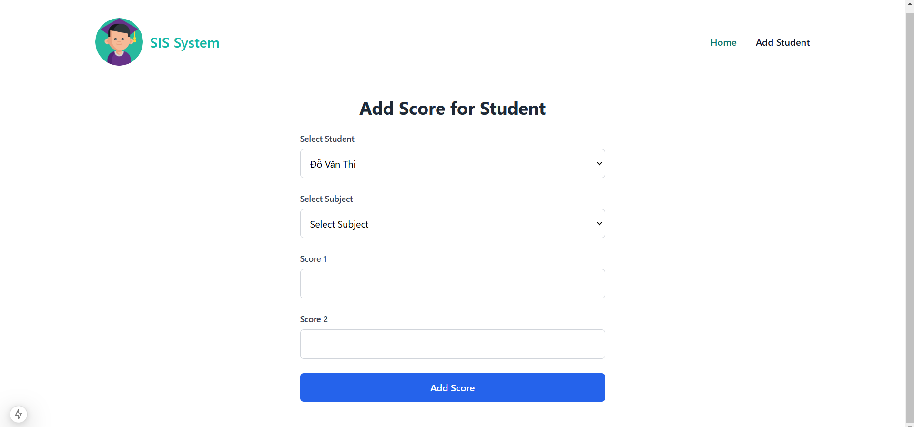

# Dự Án Dothi

## Mô Tả

Đây là một dự án liên quan đến phát triển giao diện người dùng và các chức năng cơ bản

## Ảnh Màn Hình

### 1. Homepage

Dưới đây là ảnh màn hình giao diện trang chủ của ứng dụng.

### 2. Add Student

Giao diện để thêm sinh viên mới vào hệ thống.

### 3. Add Score

Giao diện để thêm điểm cho sinh viên.

### 4. Add Subject

Giao diện để thêm môn học mới vào hệ thống.

### 5. Edit Score

Giao diện chỉnh sửa điểm của sinh viên.

## Các Thư Mục

- `dothi`: Backend của dự án, sử dụng Spring Boot.
- `frontend`: Chứa mã nguồn frontend của dự án, được phát triển bằng Next.js.
